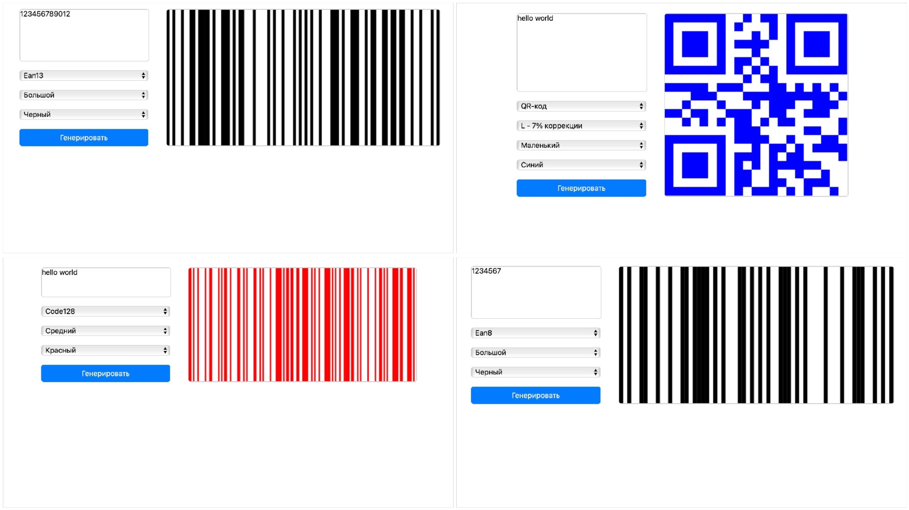

# Code Generator

Code Generator is a versatile tool for generating **barcodes** and **QR codes** in various formats, sizes, and colors.  
It supports `code128`, `ean13`, `ean8`, and `qr-code` with customizable scaling and color options.  

Create codes quickly for testing, labeling, or any project that requires machine-readable codes.  

All code generation logic is implemented from scratch, without using any external libraries.

##  Generated code preview

  

## Features

- Generate **QR codes** with different error correction levels
- Generate **barcodes**: `code128`, `ean13`, `ean8`
- Adjustable **size**: small, medium, large
- Customizable **color**: blue, red, black

## Prerequisites

- Python (v3.9 or higher)
- Node.js (v18 or higher)

## Usage

1. Enter the text you want to encode.
2. Select the code type (`QR code` or one of the barcodes).
3. Pick size and color.
4. Click **Generate** to see the code on the canvas.

> [!NOTE]
> QR codes support error correction levels:
>
> - **L** – 7% correction
> - **M** – 15% correction
> - **Q** – 25% correction
> - **H** – 30% correction
